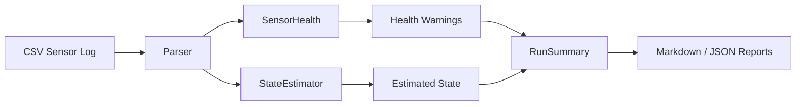

# Architecture: C++ Robot State Estimator

## Components

| Component | Purpose |
|---|---|
| `SensorReading.hpp` | Defines raw simulated GPS, IMU, rangefinder, velocity, and battery data. |
| `SensorHealth` | Validates sensor inputs and returns warnings/confidence score. |
| `StateEstimator` | Maintains filtered robot state and avoids corrupting state when sensors drop out. |
| `RunSummary` | Aggregates run results and writes Markdown/JSON reports. |
| `main.cpp` | CLI entry point for loading CSV logs and producing estimated state output. |

## State-estimation approach

This is not a full Kalman filter. It intentionally uses a simple exponential smoothing approach to demonstrate robotics-oriented C++ structure, validation, and safety-aware handling of bad inputs.

If GPS is invalid, the estimator keeps the previous valid position estimate. If IMU heading is invalid, it keeps the previous valid heading. Confidence is reduced when sensors become unreliable.
